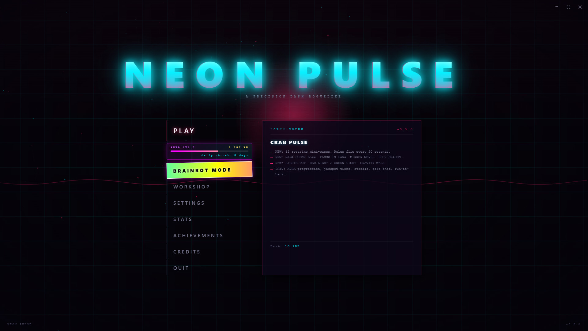
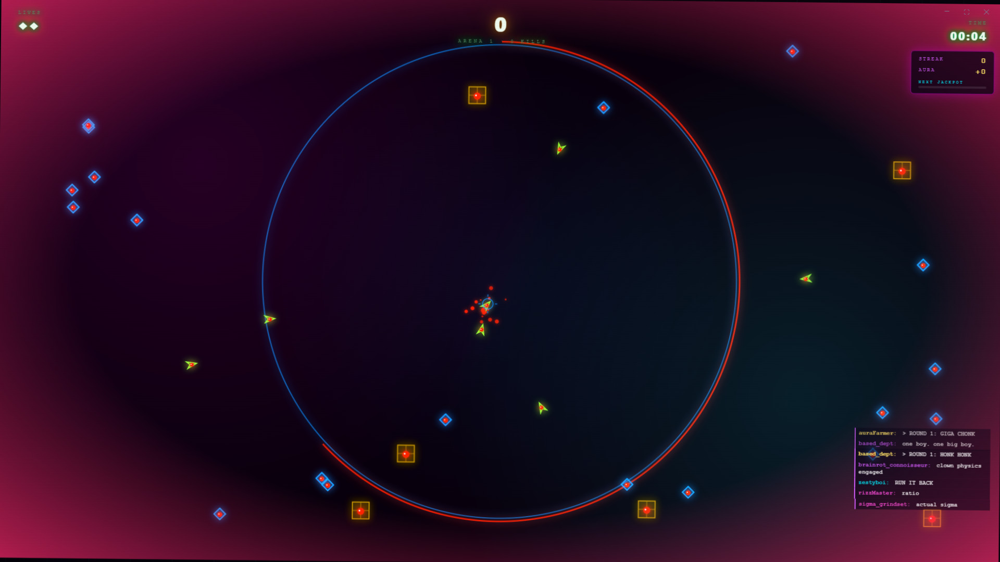

# NEON PULSE

**A precision dash roguelike set in a neon-drenched void.**

Charge your pulse drive, aim with the cursor, release to dash through waves of hostile drones.
Clear arenas, pick upgrades, chase combos. Every run is a different build, every build ends in chaos.

[](https://github.com/OutBlade/neon-pulse/releases/latest)
[](https://outblade.github.io/neon-pulse/)
[](https://github.com/OutBlade/neon-pulse/releases/latest)

---

<p align="center">
  
</p>

<p align="center">
  
</p>

---

## Features

- Launcher with main menu, patch notes, settings, statistics, achievements, and credits
- 15 unlockable achievements with persistent cross-run statistics
- 15 roguelike upgrades across three rarities — common, rare, legendary
- Five enemy types with distinct behaviors: basic, fast, tank, shooter, splitter
- Procedural Web Audio engine — no audio files required
- AURA progression system with daily streaks and jackpot tiers
- Brainrot Mode — 12 rotating mini-games, rules flip every 20 seconds
- Neon-synthwave aesthetic: particles, chromatic aberration, CRT scanlines, screen shake (all toggleable)

## Controls

| Input | Action |
|-------|--------|
| Mouse move | Aim |
| Hold left mouse / Space | Charge dash |
| Release | Dash — destroys enemies and projectiles in path |
| Esc / P | Pause |
| F11 | Toggle fullscreen (Electron) |

Longer charges produce longer dashes. Your ship drifts slowly toward the cursor.

## Run from source

```bash
npm install
npm start          # desktop app (Electron)
npm run web        # browser via local dev server
```

Or open `src/index.html` directly — save data, CRT filter, and audio all work over `file://`.

## Build installer

```bash
npm run dist:win   # Windows NSIS installer + portable
npm run dist       # all platforms (run on matching host)
```

Output lands in `dist/`. Auto-update is wired via `electron-updater` — the app checks for new releases on launch and every 15 minutes, downloads silently, and installs on quit.

## Project structure

```
neon-pulse/
  main.js              Electron main process (window, updater, IPC)
  preload.js           Secure context bridge
  package.json         npm + electron-builder config
  src/
    index.html
    styles/
      launcher.css     Menu, settings, stats, achievements UI
      game.css         HUD, upgrades, game-over overlay
    js/
      launcher.js      Menu routing, toasts, screen controller
      game.js          Core loop, arenas, physics, rendering
      audio.js         Procedural Web Audio engine
      storage.js       localStorage persistence
      achievements.js  Achievement definitions and runtime checks
  docs/
    screenshots/       Menu and gameplay screenshots
```

## Upgrades

**Common (70%):** Extended Arc, Quick Recovery, Rapid Charge, Wider Pulse, Momentum

**Rare (25%):** Shockwave, Piercing Pulse, Second Wind, Temporal Field, Magnetic Field

**Legendary (5%):** Overdrive, Echo, Ghost Protocol, Scavenger

## Achievements

First Pulse, Triple Threat, Rhythmbreaker, Harmonic Overload, Deep Signal,
Event Horizon, Neon Pedigree, Overclock, Untouchable, Long Night, Momentum,
Clearance, Static, Loadout Complete, Chosen Frequency

## License

MIT